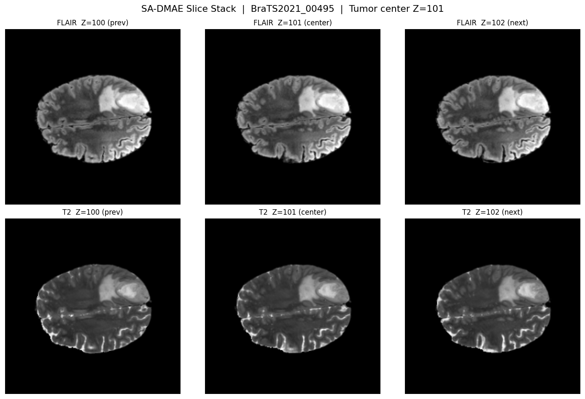
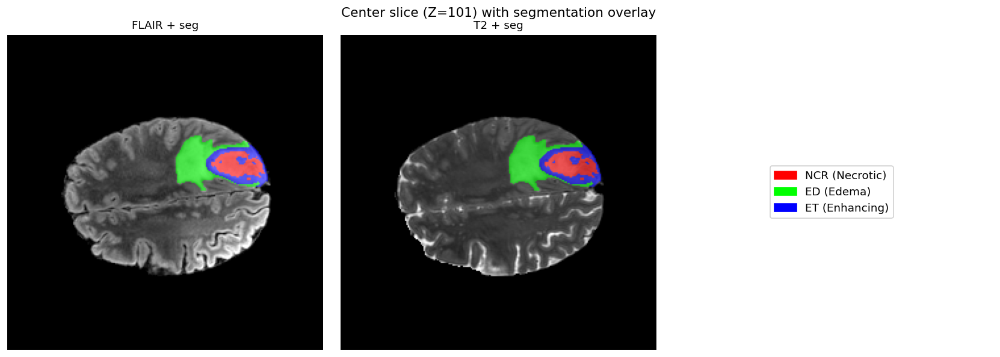
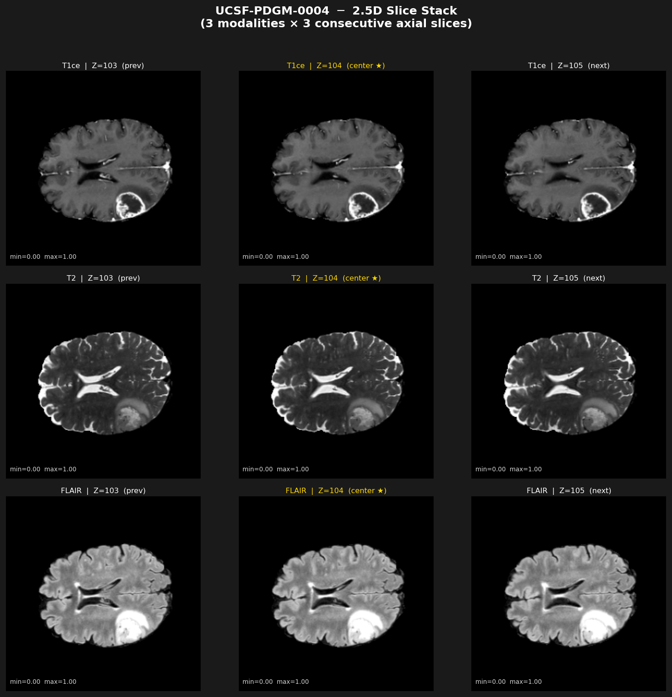
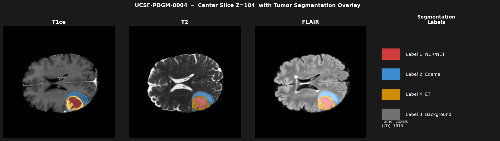

# SA-DMAE: Spatial-Axial Denoising Masked Autoencoder

> 컴퓨터비전 수업 프로젝트 — 다반 7팀 (김윤호, 김원혁)  
> ACCV 2026 투고 목표

**SA-DMAE**는 [DMAE (ICLR 2023)](https://github.com/quanlin-wu/dmae)를 2.5D 뇌종양 MRI 복원에 맞게 확장한 모델입니다.  
인접 axial 슬라이스 간 Cross-Attention (Axial Stream)을 도입해 슬라이스 간 해부학적 연속성을 토큰 수준에서 학습합니다.

---

## 📊 핵심 결과

| 모델 | MSE ↓ | PSNR ↑ | SSIM ↑ | Val Loss |
|------|-------|--------|--------|----------|
| DMAE (baseline) | 0.0051 | 23.07 dB | 0.7576 | 0.1067 |
| **SA-DMAE (ours)** | **0.0019** | **27.47 dB** | **0.8636** | **0.0411** |
| **개선** | **−62.7%** | **+4.40 dB** | **+0.1060** | **−61.4%** |

> 100 샘플 평균 · Validation Set · 동일 데이터·하이퍼파라미터 조건에서 fair comparison  
> SA-DMAE 최종 설정: `n_slices=3, axial_depth=2` (ablation 결과 기준 최적)

---

## 🏗️ 아키텍처

```
Input: (B, 3, 3, 224, 224)
       └─ 3장 연속 axial 슬라이스 × 3채널 (T1ce / T2 / FLAIR)

  ┌────── Spatial Stream ──────┐    ┌────── Axial Stream ──────┐
  │  center slice               │    │  prev / center / next    │
  │  + Gaussian noise (σ=0.25) │    │  (no masking)            │
  │  + random masking (75%)    │    │  shared ViT weights      │
  └────────────┬───────────────┘    └────────────┬─────────────┘
               │                                 │
               └──────────────┬──────────────────┘
                              ↓
                   ViT Block × 8  (shared weights)
                              ↓
          [ViT Block → AxialAttentionBlock] × 4
               Cross-Attention: Q=center, KV=prev/next
                              ↓
                    Decoder (DMAE 동일, depth=8)
                              ↓
               MSE Reconstruction Loss (center slice 기준)
```

| 컴포넌트 | 설명 |
|----------|------|
| **Spatial Stream** | 중앙 슬라이스에 노이즈+마스킹 → 원본 복원 (DMAE와 동일) |
| **Axial Stream** | 인접 슬라이스(prev/next) 문맥 인코딩, Spatial과 ViT 가중치 공유 |
| **AxialAttentionBlock** | Cross-Attention으로 인접 슬라이스 정보를 중앙 슬라이스에 융합 |
| **n_slices=3** | 연속 3장 axial 슬라이스 처리 |
| **axial_depth=4** | 마지막 4개 ViT 블록에 AxialAttentionBlock 적용 |

---

## 🗄️ 데이터셋

| 데이터셋 | 케이스 수 | 모달리티 | 비고 |
|----------|-----------|----------|------|
| BraTS 2021 | 1,251 | T1ce / T2 / FLAIR | seg 파일로 종양 center 추출 |
| UCSF-PDGM | 318 | T1ce / T2 / FLAIR | T2 없는 183개 스킵 |
| **합계** | **1,569** | | Pre-training에 사용 |

**전처리 방식:** 3D NIfTI → 종양 ROI 중심 Z축 기준 연속 3장 axial 슬라이스 추출 → `(3, 3, 224, 224)` `.pt` 파일

### 2.5D 슬라이스 구성 예시

**BraTS 2021** — FLAIR prev/center/next 슬라이스 + 종양 segmentation 오버레이




**UCSF-PDGM** — 3채널 × 3장 2.5D 슬라이스 스택 (T1ce/T2/FLAIR × prev/center/next)




---

## 📈 실험 결과

### Pre-training Loss 수렴

| | DMAE | SA-DMAE |
|--|------|---------|
| Train Loss (200 epoch) | 0.0931 | 0.0388 |
| **Val Loss (200 epoch)** | **0.1067** | **0.0411** |
| Train/Val 갭 | 0.0136 | 0.0023 |

- SA-DMAE: train/val 갭 0.002 → 과적합 없이 안정적 수렴
- DMAE baseline: 동일 아키텍처(n_slices=1, axial_depth=0)로 fair comparison 재현

### Ablation: axial_depth 비교

| axial_depth | MSE ↓ | PSNR ↑ | SSIM ↑ | 비고 |
|---|---|---|---|---|
| 0 | 0.0051 | 23.07 dB | 0.7576 | DMAE (baseline) |
| **2** | **0.0019** | **27.47 dB** | **0.8636** | **SA-DMAE (최종 설정)** |
| 4 | 0.0019 | 27.37 dB | 0.8581 | SA-DMAE (heavy) |

> axial_depth=2에서 대부분의 성능 향상이 달성됨. depth=2→4 간 차이는 미미(0.1 dB)하여 depth=2를 기본값으로 채택.

### PSNR 상세 비교 (FLAIR, 샘플별)

| 케이스 | DMAE | SA-DMAE | 향상 |
|--------|------|---------|------|
| #1 | 23.2 dB | 26.9 dB | +3.7 dB |
| #2 | 22.7 dB | 27.1 dB | +4.4 dB |
| #3 | 23.1 dB | 26.3 dB | +3.2 dB |
| #4 | 23.7 dB | 27.4 dB | +3.7 dB |
| **평균** | **23.2 dB** | **26.9 dB** | **+3.75 dB** |

### 복원 시각화

> `colab_visualize.ipynb` Cell 8 실행 후 `assets/results/reconstruction_comparison.png` 로 저장 예정

```
[ Original | Masked (75%) | SA-DMAE 복원 | Error Map ]
```

<!-- 결과 이미지 생성 후 아래 주석을 해제하여 사용:

-->

---

## 📁 프로젝트 구조

```
SA-DMAE/
├── models_sa_dmae.py        # SA-DMAE 모델 (핵심) — AxialAttentionBlock 포함
├── models_seg.py            # Segmentation fine-tuning 모델
├── dataset_medical.py       # BraTS 2021 / UCSF-PDGM 데이터셋 (pre-training)
├── dataset_seg.py           # BraTS 2021 segmentation 데이터셋 (fine-tuning)
├── main_pretrain_sa.py      # Pre-training 스크립트
├── main_finetune_seg.py     # Segmentation fine-tuning 스크립트
├── colab_preprocess.ipynb   # Colab 전처리 (3D NIfTI → 2.5D .pt)
├── colab_train.ipynb        # Colab pre-training 노트북
├── colab_visualize.ipynb    # Colab 복원 시각화 노트북
├── colab_compare.ipynb      # Colab SA-DMAE vs DMAE 비교 노트북
├── colab_finetune_seg.ipynb # Colab segmentation fine-tuning 노트북
├── assets/                  # 이미지 리소스
│   ├── brats_slice_stack.png
│   ├── brats_seg_overlay.png
│   ├── ucsf_slices.png
│   ├── ucsf_overlay.png
│   └── results/             # 실험 결과 이미지 (Colab 실행 후 저장)
├── util/
│   ├── misc.py              # 학습 유틸 (torch 2.x 호환)
│   ├── pos_embed.py         # Positional embedding (numpy 2.x 호환)
│   └── lr_sched.py
└── requirements.txt
```

---

## ⚙️ 환경 설정

```bash
git clone https://github.com/whkim4338/SA-DMAE.git
cd SA-DMAE
pip install -r requirements.txt
```

**주요 의존성:** `torch 2.x`, `timm 1.x`, `nibabel`, `numpy 2.x`

---

## 🔧 데이터 준비

### Colab 전처리 (권장)

1. BraTS 2021 / UCSF-PDGM 데이터를 Google Drive에 업로드
2. `colab_preprocess.ipynb` 를 Colab에서 실행 — Cell 3의 경로만 수정
3. 생성된 `.pt` 파일을 Drive에 유지 (학습 시 Drive 마운트)

```
pt_slices/
├── brats/   ← BraTS .pt 파일 (1,251개)
└── ucsf/    ← UCSF .pt 파일 (318개)
```

### NIfTI 디렉토리 구조

```
datasets/BraTS2021/
└── BraTS2021_00000/
    ├── BraTS2021_00000_t1ce.nii.gz
    ├── BraTS2021_00000_t2.nii.gz
    ├── BraTS2021_00000_flair.nii.gz
    └── BraTS2021_00000_seg.nii.gz
```

---

## 🚀 Pre-training 실행

### `.pt` 파일로 학습 (권장, Colab T4)

```bash
python main_pretrain_sa.py \
    --data_path  ./pt_slices/brats \
    --ucsf_path  ./pt_slices/ucsf \
    --preprocessed \
    --model      sa_dmae_vit_base_patch16 \
    --n_slices   3 \
    --axial_depth 4 \
    --epochs     200 \
    --batch_size 32 \
    --sigma      0.25 \
    --mask_ratio 0.75 \
    --lr         1.5e-4 \
    --warmup_epochs 40 \
    --output_dir ./output_sa \
    --device     cuda
```

### DMAE 베이스라인 재현 (fair comparison)

```bash
python main_pretrain_sa.py \
    --data_path  ./pt_slices/brats \
    --ucsf_path  ./pt_slices/ucsf \
    --preprocessed \
    --n_slices   1 \
    --axial_depth 0 \
    --output_dir ./output_dmae \
    --device     cuda
```

### 주요 하이퍼파라미터

| 인자 | 기본값 | 설명 |
|------|--------|------|
| `--n_slices` | `3` | 연속 슬라이스 수 (홀수, SA-DMAE: 3, DMAE: 1) |
| `--axial_depth` | `2` | AxialAttentionBlock 레이어 수 (DMAE: 0) |
| `--sigma` | `0.25` | Gaussian noise 표준편차 |
| `--mask_ratio` | `0.75` | 랜덤 마스킹 비율 |
| `--lr` | `1.5e-4` | Learning rate |
| `--warmup_epochs` | `40` | Cosine LR warmup 에폭 수 |
| `--preprocessed` | `False` | `.pt` 파일 사용 여부 |
| `--batch_size` | `32` | 배치 크기 (T4 16GB 기준) |

> **VRAM 참고:** Colab T4 (15GB) 기준 `--batch_size 32` 권장. OOM 발생 시 `16`으로 낮출 것.

---

## 📉 학습 모니터링

```bash
tensorboard --logdir ./output_sa
```

체크포인트는 `output_sa/checkpoint-{epoch}.pth` 로 20 epoch마다 저장.

---

## 🔬 Segmentation Fine-tuning (Future Work)

SA-DMAE pre-trained encoder를 고정(frozen)하고 BraTS 2021 종양 segmentation에 fine-tuning하는 실험을 포함합니다.

```bash
python main_finetune_seg.py \
    --pt_dir     ./pt_slices/brats \
    --nifti_dir  ./datasets/BraTS2021 \
    --resume     ./output_sa/checkpoint-best.pth \
    --n_slices   3 --axial_depth 4 \
    --epochs     50 --batch_size 16 --lr 1e-3 \
    --output_dir ./output_seg
```

| 클래스 | Best Val Dice | 설명 |
|--------|--------------|------|
| WT (Whole Tumor) | 0.0749 | 전체 종양 |
| TC (Tumor Core) | 0.0335 | 괴사+강화 종양 |
| ET (Enhancing) | 0.0188 | 강화 종양 |

> 심각한 클래스 불균형(종양 픽셀 ~5%)으로 현재 성능 제한적. Decoder 구조 개선 및 충분한 학습 시간 확보가 향후 과제.

---

## 📝 Colab 노트북 실행 순서

| 노트북 | 내용 | 소요시간 |
|--------|------|---------|
| `colab_preprocess.ipynb` | NIfTI → 2.5D `.pt` 전처리 | ~30분 |
| `colab_train.ipynb` | SA-DMAE pre-training (200 epoch) | ~4시간 |
| `colab_compare.ipynb` | SA-DMAE vs DMAE 복원 비교 | ~10분 |
| `colab_visualize.ipynb` | 복원 결과 4-column 시각화 | ~5분 |
| `colab_finetune_seg.ipynb` | Segmentation fine-tuning | ~2시간 |

---

## 📌 베이스라인

이 프로젝트는 [DMAE (ICLR 2023)](https://github.com/quanlin-wu/dmae) 를 기반으로 합니다.

```bibtex
@inproceedings{wu2023dmae,
  title     = {Denoising Masked Autoencoders Help Robust Classification},
  author    = {Wu, QuanLin and Ye, Hang and Gu, Yuntian and Zhang, Huishuai
               and Wang, Liwei and He, Di},
  booktitle = {ICLR},
  year      = {2023}
}

@inproceedings{he2022mae,
  title     = {Masked Autoencoders Are Scalable Vision Learners},
  author    = {He, Kaiming and Chen, Xinlei and Xie, Saining and Li, Yanghao
               and Doll{\'a}r, Piotr and Girshick, Ross},
  booktitle = {CVPR},
  year      = {2022}
}

@article{baid2021brats,
  title   = {The RSNA-ASNR-MICCAI BraTS 2021 Benchmark on Brain Tumor
             Segmentation and Radiogenomic Classification},
  author  = {Baid, Ujjwal and others},
  journal = {arXiv preprint arXiv:2107.02314},
  year    = {2021}
}
```
